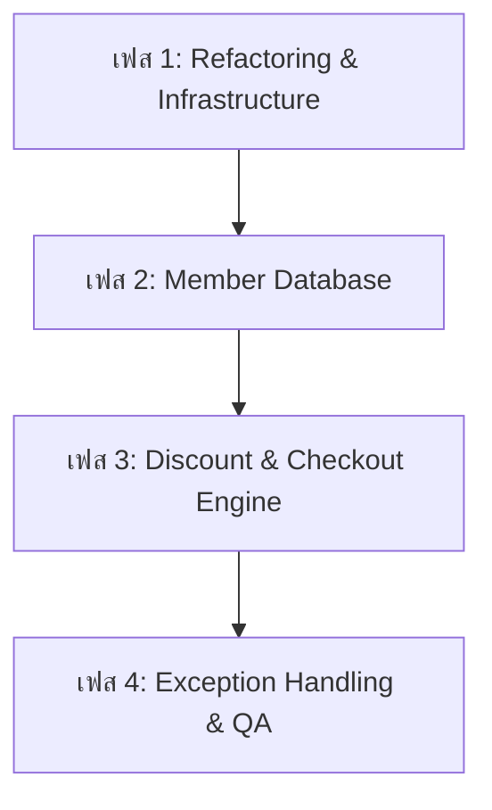

# แผนงานโครงการและการประเมินความเสี่ยง: ระบบสมาชิกลดราคา (Member Discount)
**ระบบ: CLI Inventory Management System**
**วิชา: Software Evolution and Maintenance**

เอกสารฉบับนี้จัดทำขึ้นเพื่อนำเสนอแผนงานขอบเขตการทำงาน (Scope) และการประเมินความเสี่ยง (Risk Assessment) ในการพัฒนาเพิ่มฟีเจอร์ **ระบบสมาชิกลดราคา (Member Discount)** ให้มีความเสถียรและทนทานต่อข้อผิดพลาดสูง บนพื้นฐานสถาปัตยกรรมเดิมของระบบจัดการคลังสินค้าที่มีอยู่ในปัจจุบัน 

---

## 1. การวางแผนการทำงาน (Scope of Work Planning)

เพื่อประกันความเสถียรสูงสุดของระบบและป้องกันปัญหาซอฟต์แวร์แครช ทีมพัฒนาได้แบ่งการขอบเขตการทำงานออกเป็น 4 เฟสหลัก ดังนี้:



### เฟส 1: การวางรากฐานและจัดโครงสร้างสถาปัตยกรรม (Refactoring & Infrastructure)
*   **เป้าหมาย:** แยกส่วนแสดงผล CLI ออกจากตรรกะประมวลผลทางธุรกิจเพื่อให้โค้ดรองรับการต่อขยายได้อย่างมีระเบียบ
*   **ขอบเขตงานย่อย:**
    1.  **แยกไฟล์ฐานข้อมูล:** กำหนดโครงสร้างแยกจัดเก็บข้อมูลระหว่างคลังสินค้าและสมาชิก โดยสร้างไฟล์ `members.json` แยกขาดจาก [data.json] เพื่อความยืดหยุ่นในการอ่านเขียนข้อมูล
    2.  **Modular Architecture:** ย้ายตัวแปร Global `x` ดั้งเดิม และเปลี่ยนไปใช้การสร้าง Class หรือ Module เช่น `class InventoryManager` และ `class MemberManager` ในการจัดการสถานะภายในหน่วยความจำชั่วคราว
    3.  **Clean Code:** ยุบส่วนตรรกะที่ซ้ำซ้อนในโค้ดต้นฉบับให้มีความกะทัดรัด (อาทิ ปัญหาความซ้ำซ้อนของเงื่อนไขเพิ่มและแก้ไขสินค้า)

### เฟส 2: การจัดการฐานข้อมูลสมาชิก (Member Database Integration)
*   **เป้าหมาย:** สร้างโครงสร้างข้อมูลและสิทธิ์ระดับสมาชิกรองรับการคำนวณส่วนลด
*   **ขอบเขตงานย่อย:**
    1.  กำหนดโครงสร้างข้อมูลโมเดลสมาชิก (Schema Design):
        ```json
        {
          "member_id": "M1001",
          "name": "Jane Doe",
          "tier": "Gold", 
          "discount_rate": 0.10
        }
        ```
    2.  สร้างเมธอดสำหรับการเพิ่ม ค้นหา และบันทึกข้อมูลสมาชิก (LOAD/SAVE) ลงในไฟล์ `members.json`
    3.  ประยุกต์ใช้วิธี **Safe Atomic Write** ในการเขียนไฟล์สมาชิกเพื่อป้องกันข้อมูลพังในยามเกิดเหตุฉุกเฉิน

### เฟส 3: ปรับปรุงตรรกะการคำนวณและทำรายการขาย (Discount & Checkout Engine)
*   **เป้าหมาย:** ปรับปรุงโฟลว์ในตัวเลือกเมนูที่ 3 (Out) จากเดิมที่ทำการหักลบจำนวนสต็อกสินค้าเฉยๆ ให้เปลี่ยนระบบเป็นเครื่องชำระเงินจำลอง (Checkout Flow)
*   **ขอบเขตงานย่อย:**
    1.  **พัฒนาระบบรับข้อมูลการจ่ายยอดสินค้า:**
        *   ระบุรหัสสินค้าและจำนวนชิ้น
        *   เรียกหาคีย์รหัสสมาชิก (Member ID)
    2.  **ตรรกะคำนวณส่วนลด (Discount Logic Engine):**
        *   หากใส่ Member ID และพบข้อมูลในฐานข้อมูล -> คำนวณส่วนลดตามเรท (เช่น Gold หักลด 10%, Silver หักลด 5%)
        *   หากไม่พบข้อมูล หรือปล่อยว่าง -> คำนวณตามราคาปกติ (0% Discount)
    3.  **การแสดงผลรายละเอียดการคิดเงิน:** แสดงผล Subtotal, Discount, และ Grand Total ก่อนทำเรื่องหักสต็อกและสั่งบันทึกข้อมูลลงดิสก์

### เฟส 4: เพิ่มระบบดักข้อผิดพลาดเชิงลึกและทดสอบ (Exception Handling & QA)
*   **เป้าหมาย:** ตรวจเช็คเคสขอบเขตอันตรายและเสริมการทนทานต่อข้อผิดพลาด (Fault Tolerance)
*   **ขอบเขตงานย่อย:**
    1.  เขียนดักจับประเภทข้อมูลนำเข้าที่แปลกปลอมในฟิลด์นำเข้าสำหรับสมัครสมาชิกใหม่และหักแต้มส่วนลด
    2.  ทำระบบตรวจสอบสถานะความเสียหายของฐานข้อมูล หากโครงสร้างไฟล์ใดเกิดปัญหาขึ้น ระบบต้องทำงานแบบประคับประคองประคองสถานะ (Graceful Degradation) ได้
    3.  พัฒนา Unit Tests ครอบคลุมเคสการคิดคำนวณยอดเงินและส่วนลดของสมาชิกระดับ Tier ต่างๆ ให้ผ่านทั้งหมด 100%

---

## 2. การประเมินความเสี่ยงและแนวทางแก้ไข (Risk Assessment)

เพื่อรักษาระดับความเสถียรไม่ให้โปรแกรม CLI ล่มง่ายจากการขยายขนาดระบบ ทีมพัฒนาประเมินความเสี่ยงและกำหนดแนวทางการควบคุมไว้ดังนี้:

| ⚠️ หัวข้อความเสี่ยง (Risk Category) | 💥 ผลกระทบต่อระบบ (Impact) | 🛡️ มาตรการการป้องกันและควบคุม (Mitigation Strategies) |
| :--- | :--- | :--- |
| **1. Spaghetti Coupling Risk** <br>(ตรรกะผูกพันกันยุ่งเหยิง) | การแทรกโค้ดคิดลดราคาลงในตัวเลือกเมนู CLI ตรงๆ จะเพิ่มความสับสนและจุดอ่อนให้แอปพลิเคชันพังได้ง่ายหากมีจุดใดเกิด Error | * **Apply MVC Design Pattern:** แยกส่วนการนำเสนอ Interface (CLI `print`) ออกจาก Logical Core (ฟังก์ชันการคำนวณราคาส่วนลดและสต็อก) อย่างเด็ดขาด<br>* ควบคุมการส่งต่อข้อมูลด้วยอาร์กิวเมนต์แทนการแก้ไขสถานะในตัวแปร Global |
| **2. Partial Database Failure** <br>(ฐานข้อมูลเกิดการบันทึกได้เพียงบางส่วน) | กรณีโปรแกรมขัดข้องหลังจากการตัดยอดสต็อกใน `data.json` สำเร็จ แต่ยังไม่ทันบันทึกรายการใช้งานส่วนลดสมาชิกใน `members.json` ทำให้ข้อมูลเสียสมดุล | * **Consolidated Atomic Transaction:** บันทึกข้อมูลคลังและสมาชิกโดยผ่านกลไกไฟล์ชั่วคราว (Temporary Files) พร้อมกัน<br>* หากพบความล้มเหลวในการเขียนข้อมูลไฟล์ใดไฟล์หนึ่ง ระบบต้องแจ้งเตือนเพื่อยกเลิกการแก้ไขและแจ้งเตือนผู้ใช้งานทันที |
| **3. Negative Value / Overflow Exploits** <br>(ช่องโหว่จากการคำนวณ) | ผู้ใช้อาจใส่สิทธิ์ลดราคาเป็นค่าติดลบ หรือค่าเกิน 1.0 (ลดราคา 150%) ซึ่งส่งผลลัพธ์ให้ระบบยอดเงินคิดเงินผิดเพี้ยน | * **Strict Input Validation Rules:** ตรวจทานความถูกต้อง ณ จุดรับข้อมูลทันทีว่าค่า discount rate ของสมาชิกแต่ละคนจะต้องอยู่ระหว่าง `0.0 <= rate <= 1.0` เท่านั้น และราคาสุทธิหลังหักส่วนลดต้องไม่มีวันติดลบ |
| **4. Database Corruption on Startup** <br>(ไฟล์เก็บข้อมูลสมาชิกเสียหายตั้งแต่เปิดเครื่อง) | หาก `members.json` พังหรือเขียนผิดพลาด จะดึงโปรแกรมหลักให้เปิดไม่ขึ้นและใช้ระบบสต็อกไม่ได้ตามไปด้วย | * **Graceful Degraded State:** ออกแบบโครงสร้างฟังก์ชันการโหลดระบบโดยครอบด้วย `try-except` หากระบบสมาชิกเกิดล้มเหลว โปรแกรมหลักจะต้องยังสามารถทำงานในโหมด "Guest-Only" (ทำได้แค่หักยอดราคาเต็ม) แทนที่จะ Crash และหยุดทำงานไปเลย |
| **5. Regression Bugs** <br>(การเพิ่มเติมจุดหนึ่งกลับไปทำลายจุดเดิม) | การแก้ไขฟังก์ชันตัดสต็อก (เมนู 3) เพื่อแทรกระบบส่วนลดสมาชิก อาจส่งผลให้ระบบการส่งคำเตือนเมื่อสินค้าสต็อกเหลือน้อยกว่า 5 ชิ้นดั้งเดิมใช้งานไม่ได้ | * **Continuous Automated Integration:** เขียนสคริปต์ Unit Test ป้องกันไว้ล่วงหน้าเพื่อตรวจสอบพฤติกรรมการแจ้งเตือน (Warning System) และสัดส่วนค่าต่างๆ ตลอดช่วงระยะ Refactoring โค้ดเก่า |
