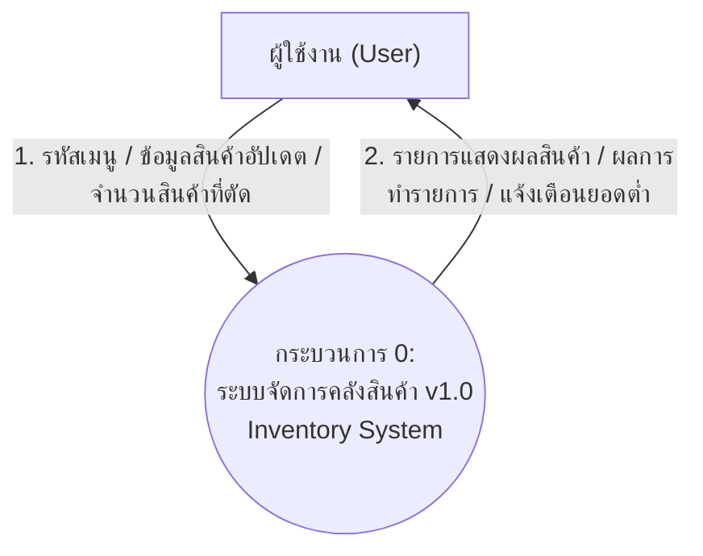
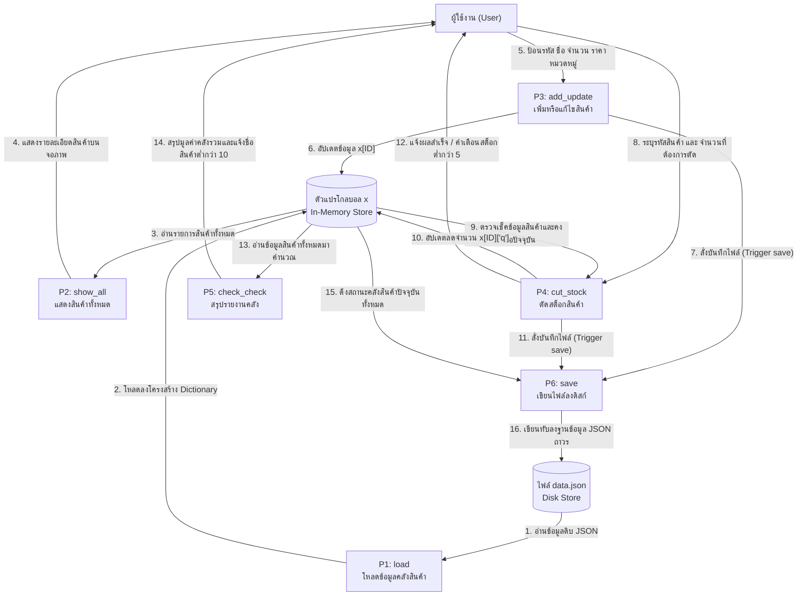

# แผนภาพกระแสข้อมูล (Data Flow Diagram - DFD)
**ระบบจัดการคลังสินค้า (Inventory Management System v1.0)**

---

## 1. ข้อกำหนดและกฎการเขียน DFD (DFD Rules & Standards)

เพื่อให้สอดคล้องกับมาตรฐานการวิเคราะห์และออกแบบระบบ:
1. **Process (กระบวนการ):** ต้องใช้คำกริยานำหน้าตามด้วยนามเอกพจน์ (เช่น โหลดข้อมูล, บันทึกข้อมูล) และมีหมายเลขกำกับ (ID) เสมอ
2. **External Entity (ผู้เกี่ยวข้องภายนอก):** ห้ามเชื่อมโยงข้อมูลระหว่าง Entity ถึง Entity หรือ Entity ถึง Data Store โดยตรงโดยไม่ผ่าน Process
3. **Data Store (แหล่งเก็บข้อมูล):** ห้ามเคลื่อนย้ายข้อมูลระหว่าง Data Store ถึง Data Store โดยตรงโดยไม่ผ่าน Process
4. **ความถูกต้องของข้อมูล (No Anomalies):** ป้องกันการเกิด Black Holes (มีแต่อินพุตไม่มีเอาต์พุต) และ Miracles (มีแต่เอาต์พุตไม่มีอินพุต)

---

## 2. แผนภาพบริบท (Context Diagram - DFD Level 0)

แผนภาพบริบทเป็นแผนภาพระดับสูงสุด แสดงภาพรวมการเชื่อมต่อระหว่างระบบและผู้ใช้งานภายนอก 

---

## 3. แผนภาพระดับรายละเอียด (DFD Level 1)

แผนภาพระดับนี้จะขยายส่วนการทำงานภายในกระบวนการของระบบ โดยเผยให้เห็นกระบวนการทำงานย่อย (P1 - P6) แหล่งเก็บข้อมูลในหน่วยความจำชั่วคราว (**ตัวแปรโกลบอล x**) และไฟล์บันทึกถาวร (**data.json**)

---

## 4. ตารางประเมินการวิ่งของข้อมูล (Data Flow Mapping Table)

| กระบวนการทำงาน (Process) | ข้อมูลนำเข้า (Input Data Flow) | แหล่งที่มา (Source) | ข้อมูลส่งออก (Output Data Flow) | แหล่งปลายทาง (Destination) | ช่วงเวลาการบันทึกไฟล์ (Save Time) |
| :--- | :--- | :--- | :--- | :--- | :--- |
| **P1: load** | ข้อมูลแฟ้ม JSON | แหล่งเก็บข้อมูล `data.json` | โครงสร้าง Dictionary | ตัวแปรโกลบอล `x` | รันครั้งเดียวเมื่อเริ่มรันโปรแกรม |
| **P2: show_all** | รายการสินค้า | ตัวแปรโกลบอล `x` | รายละเอียดสินค้าบนหน้าจอ | ผู้ใช้งาน (User) | ไม่มีการบันทึกไฟล์ |
| **P3: add_update** | ข้อมูลสินค้านำเข้าจากแป้นพิมพ์ | ผู้ใช้งาน (User) | อัปเดตค่า `x[ID]` และสั่ง Save | ตัวแปรโกลบอล `x` และ Process `P6` | บันทึกลงดิสก์ทันทีหลังอัปเดตเสร็จ |
| **P4: cut_stock** | รหัสสินค้า, จำนวนหัก และสต็อกเดิม | ผู้ใช้งาน (User) และตัวแปร `x` | ลดสต็อก `x[ID]['q']` และสั่ง Save | ตัวแปรโกลบอล `x` และ Process `P6` | บันทึกลงดิสก์ทันทีหลังตรวจสอบและหักยอดสำเร็จ |
| **P5: check_check** | สินค้าและราคาทั้งหมด | ตัวแปรโกลบอล `x` | รายงานมูลค่ารวม และรายชื่อสต็อกต่ำ | ผู้ใช้งาน (User) | ไม่มีการบันทึกไฟล์ |
| **P6: save** | ข้อมูลคลังทั้งหมดในเมมโมรี | ตัวแปรโกลบอล `x` | ข้อมูลไฟล์ JSON ล่าสุด | แหล่งเก็บข้อมูล `data.json` | เมื่อถูกกระตุ้นจาก `P3` หรือ `P4` |
