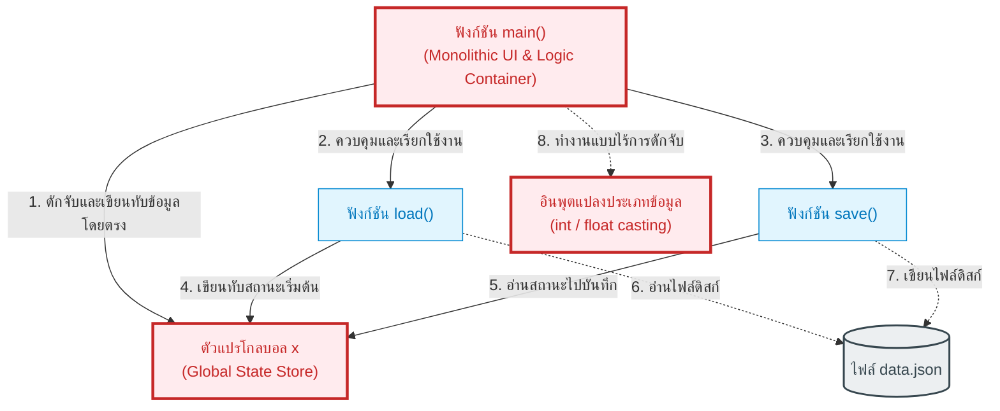

# จุดอันตรายและจุดเชื่อมโยงวิกฤต (Dangerous Hotspots Analysis)
**ระบบจัดการคลังสินค้า (Inventory Management System v1.0 - `app_v1.py`)**

เอกสารฉบับนี้ทำการวิเคราะห์และชี้เป้า **"Hotspot อันตราย"** ภายในระบบ ซึ่งเป็นจุดที่มีการผูกมัดข้อมูลอย่างหนาแน่น (High Coupling) และมีความเปราะบางสูง (High Fragility) หากนักพัฒนาทำการแก้ไขจุดเหล่านี้โดยไม่มีการเตรียมการที่ดี อาจทำให้ระบบล่มทั้งหมด (System-wide Failure)

---

## 1. แผนภาพจุดอันตราย (Hotspot Flow Diagram)

แผนภาพด้านล่างจำลองความสัมพันธ์ของระบบ และทำเครื่องหมาย **"สีแดง [จุดวิกฤต]"** ลงบนจุดวิกฤตที่มีสิทธิ์เกิดปัญหา




---

## 2. เจาะลึกจุดอันตรายรายตำแหน่ง (Detailed Hotspot Breakdown)

### Hotspot 1: ตัวแปรโกลบอล `x` (In-Memory Dictionary)
* **ลักษณะการเชื่อมโยง (Coupling):** ทุกกิจกรรมในโปรแกรม (โหลดข้อมูล, บันทึกข้อมูล, เพิ่มสินค้า, ตัดยอด, สรุปมูลค่า) ต่างวิ่งเข้ามารุมอ่านและเขียนข้อมูลในตัวแปร `x` โดยตรงผ่านการอ้างอิงคีย์ย่อย (`x[k]['n']`, `x[k]['q']` ฯลฯ)
* **ทำไมจึงอันตราย?:**
  1. **สกีมาไม่มีขอบเขตป้องกัน (No Schema Protection):** โค้ดส่วนต่าง ๆ ตกลงกติกาคีย์สั้นเพียงแค่คำอธิบาย เช่น `"n"` หรือ `"q"` หากโปรแกรมเมอร์เผลอแก้ไขคีย์จุดใดจุดหนึ่ง (เช่น เปลี่ยน `"q"` เป็น `"qty"` ในกระบวนการใดกระบวนการหนึ่ง) จะทำให้จุดอื่น ๆ ที่เรียกใช้ `"q"` เกิดข้อผิดพลาด `KeyError` และส่งผลให้ระบบพังทันที
  2. **ทดสอบระบบไม่ได้ (Untestable Code):** เนื่องจาก `x` เป็น Global State การเขียน Unit Test เพื่อจำลองเงื่อนไขใดเงื่อนไขหนึ่งจะไม่สามารถทำได้โดยไม่ไปกระทบกับการทำงานจริงของฟังก์ชันอื่น ๆ
* **แนวทางแก้ไข (Refactoring Solution):** ครอบข้อมูลตัวแปรนี้ด้วยคลาส `Product` เพื่อกำหนดฟิลด์โครงสร้างให้มีมาตรฐาน มี Type Annotation ชัดเจน และบริหารจัดการข้อมูลผ่านคลาส `InventoryManager` แทนการประกาศตัวแปรลอย ๆ

### Hotspot 2: ฟังก์ชัน `main()` (Monolithic Core)
* **ลักษณะการทำงาน:** ฟังก์ชัน `main()` มัดรวม UI (คำสั่ง `print()`, `input()`), Business Logic (การลบยอดสต็อก, การประเมินมูลค่า, การคัดกรองสินค้าต่ำกว่า 10 ชิ้น), และสิทธิ์การกระตุ้น Data Access (สั่งรัน `save()`) รวมกันในบล็อก `if/elif` เดียว
* **ทำไมจึงอันตราย?:**
  1. **ความซับซ้อนสะสม (Cyclomatic Complexity = 14):** มีเงื่อนไขการตัดกิ่งที่ซับซ้อน การเปลี่ยนแปลงแก้ไขตรรกะในเมนูใดเมนูหนึ่ง มีโอกาสสูงมากที่จะไปส่งผลกระทบข้างเคียง (Side-Effects) ต่อเมนูอื่น ๆ โดยไม่ได้ตั้งใจ
  2. **ไม่สามารถทำซ้ำได้ (Non-reusable Code):** หากผู้ใช้ต้องการเปลี่ยนจากหน้าจอ CLI (Command Line) ไปรันบนหน้าเว็บเพจ โค้ดตรรกะคำนวณทั้งหมดจะใช้ไม่ได้เลยเพราะมัดรวมแน่นกับคำสั่ง `input()` และ `print()` ไปแล้ว
* **แนวทางแก้ไข (Refactoring Solution):** แยก UI ออกจากตรรกะการประมวลผล (Separation of Concerns) แตกฟังก์ชันการทำงานเป็นโมดูลย่อย เช่น ย้ายการคำนวณยอดสต็อกและการเพิ่มสินค้าไปอยู่ในคลาส `InventoryManager` และให้ `main()` ทำหน้าที่เพียงแสดงหน้าจอรับอินพุตเท่านั้น

### Hotspot 3: จุดรับข้อมูลและแปลงประเภทในทันที (Direct Value Casting)
* **ลักษณะโค้ดที่เป็นปัญหา:**
  ```python
  c = int(input("Enter Qty: "))
  d = float(input("Enter Price: "))
  ```
* **ทำไมจึงอันตราย?:**
  1. **โปรแกรมล่มง่ายดาย (Runtime Crash):** หากผู้ใช้เผลอกด Enter ผ่านโดยไม่พิมพ์อะไร หรือป้อนตัวอักษรผิดพลาด (เช่น ใส่ `"1oo"` แทน `"100"`) ภาษา Python จะหยุดทำงานและพ่นข้อผิดพลาด `ValueError` ขึ้นมาทันที
  2. **ไม่มีการดักจับค่าขยะ (Dirty Data):** ระบบไม่ได้เช็คค่าติดลบ ทำให้ผู้ใช้สามารถใส่จำนวนสต็อกติดลบได้ ซึ่งทำให้มูลค่าคลังสินค้าผิดเพี้ยนไปทั้งหมด
* **แนวทางแก้ไข (Refactoring Solution):** สร้างฟังก์ชัน Helper สำหรับตรวจสอบการกรอกข้อมูลนำเข้าโดยเฉพาะ และใช้บล็อก `try-except` ในการทำงานร่วมกับผู้ใช้
