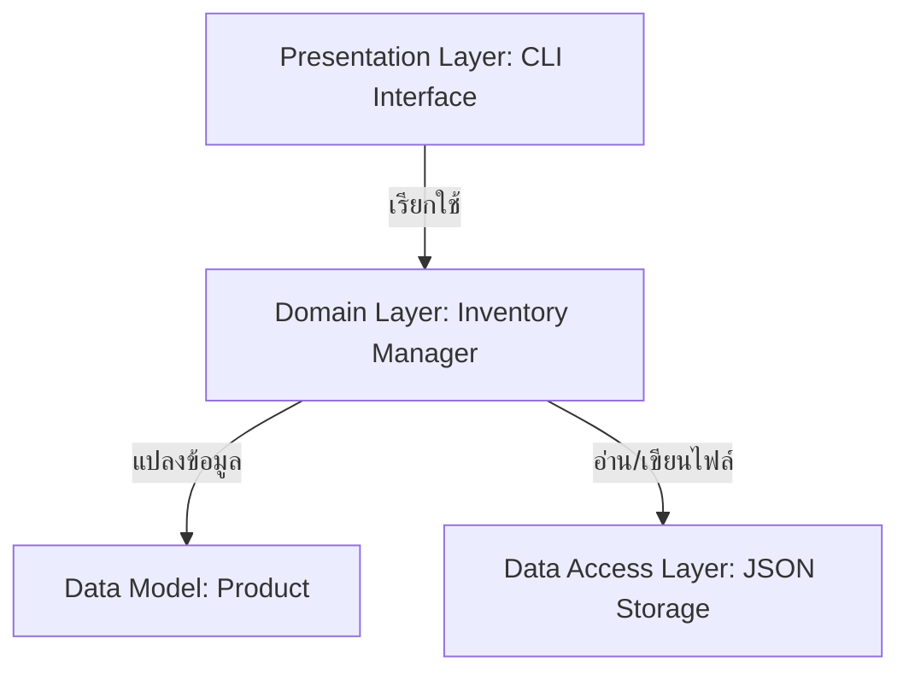

# แผนพิมพ์เขียวการปรับปรุงระบบ (Software Refactoring & Evolution Blueprint)

เอกสารฉบับนี้เป็นแผนพิมพ์เขียว (Blueprint) ที่วิเคราะห์โครงสร้างของโค้ดเดิมใน `app_v1.py` ซึ่งยังขาดความเป็นระเบียบและสถาปัตยกรรมที่ดี เพื่อเตรียมการปรับปรุงโครงสร้าง (Refactoring)

---

## 1. การวิเคราะห์ปัญหาในระบบเดิม (Code Smells & Core Issues)

จากการตรวจสอบโค้ดใน `app_v1.py` พบปัญหาสำคัญดังนี้:

| หัวข้อปัญหา | รายละเอียด / ผลกระทบ | ตัวอย่างจากโค้ดเดิม |
| :--- | :--- | :--- |
| **การตั้งชื่อตัวแปรที่คลุมเครือ (Cryptic Naming)** | ใช้ชื่อตัวแปรสั้นและไม่มีความหมาย ทำให้ผู้พัฒนาคนอื่นเข้าใจยากและมีโอกาสเกิดบั๊กสูงเมื่อโค้ดมีขนาดใหญ่ขึ้น | `x` (เก็บข้อมูลสินค้า), `n` (Name), `q` (Quantity), `p` (Price), `c` (Category) รวมถึง `a`, `b`, `c`, `d`, `e` |
| **การใช้สถานะร่วมภายนอก (Global State)** | มีการใช้ `global x` และตัวแปรภายนอก `db` ทำให้ฟังก์ชันต่าง ๆ ผูกมัดกันแน่นหนา (Tight Coupling) ทดสอบระบบเฉพาะส่วน (Unit Testing) ได้ยากมาก | `global x`<br>`with open(db, 'r') as f:` |
| **โครงสร้างแบบชิ้นเดียว (Monolithic Design)** | นำส่วนเชื่อมประสานผู้ใช้ (UI), ส่วนควบคุมตรรกะทางธุรกิจ (Business Logic) และส่วนการจัดการไฟล์ข้อมูล (Data Access) มาผสมปนเปกันในฟังก์ชัน `main()` | การพิมพ์คำสั่ง `print()` การบันทึกไฟล์ด้วย `json.dump()` และการเช็คสต็อกต่ำรวมกันอยู่ในบล็อก `elif` ของเมนู |
| **ขาดการตรวจสอบความถูกต้อง (No Input Validation)** | ไม่มีการดักจับข้อผิดพลาดหากผู้ใช้ป้อนประเภทข้อมูลผิดพลาด (เช่น ป้อนตัวอักษรในช่องจำนวนเงินหรือราคาสินค้า) ซึ่งจะทำให้โปรแกรมหยุดทำงาน (Crash) ทันที | `c = int(input("Enter Qty: "))`<br>`d = float(input("Enter Price: "))` |
| **โค้ดซ้ำซ้อน (Redundant Logic)** | มีโค้ดเงื่อนไขที่ตัดสินใจทำสิ่งเดียวกันทั้งในกรณีที่เป็นจริงและเท็จ | `if a in x: x[a] = {...} else: x[a] = {...}` ซึ่งทั้งสองกรณีทำงานเหมือนกันทุกประการ |
| **ค่าคงที่แบบฮาร์ดโค้ด (Hardcoded Values)** | กำหนดขีดจำกัดสำหรับการเตือนสต็อกต่ำ (<5 และ <10) ไว้ในตรรกะโดยตรง ทำให้แก้ไขได้ยากในอนาคต | `if x[id_to_cut]['q'] < 5:`<br>`if x[k]['q'] < 10:` |

---

## 2. การออกแบบสถาปัตยกรรมใหม่ (Proposed Architecture Blueprint)

เราจะใช้หลักการ **Separation of Concerns (SoC)** เพื่อแยกส่วนการทำงานออกเป็น 3 ส่วนหลักที่อิสระจากกัน:



### 2.1 โครงสร้างแบ่งเลเยอร์ (Three-Tier Architecture)

1. **Presentation Layer (CLI Interface):**
   - รับผิดชอบเกี่ยวกับการโต้ตอบกับผู้ใช้ทางคอนโซล (Console UI) เท่านั้น
   - ทำหน้าที่ดักจับและตรวจสอบความถูกต้องของ Input ก่อนส่งต่อไปยังบริการข้างใน (Input Validation)
   - ไม่รับรู้ถึงรูปแบบไฟล์ฐานข้อมูลหรือวิธีการคำนวณเบื้องหลัง
2. **Domain / Business Logic Layer (Inventory Manager):**
   - คลาสหลักในการเก็บตรรกะทางธุรกิจ เช่น การคำนวณมูลค่าคลังสินค้าทั้งหมด การลดจำนวนสินค้า
   - ควบคุมเงื่อนไขการแจ้งเตือนสต็อกสินค้าต่ำ (Low Stock Warnings) โดยใช้พารามิเตอร์ที่กำหนดค่าได้
3. **Data Access / Persistence Layer & Models:**
   - คลาส `Product` สำหรับแสดงโครงสร้างของตัวสินค้า มีความหมายชัดเจนและแปลงเป็น Object ได้สะดวก
   - ส่วนบันทึกและดึงข้อมูลจากไฟล์ JSON ที่ระบุพาร์ทได้ และสามารถทำ Migration ข้อมูลเดิมได้

---

## 3. การเปลี่ยนผ่านโครงสร้างข้อมูล (Data Schema Evolution)

เพื่อให้อ่านข้อมูลดิบในไฟล์ได้ง่ายขึ้น เราจะเปลี่ยนรูปแบบ JSON Schema ดังนี้:

### 3.1 รูปแบบข้อมูลเดิม (v1.0 - data.json)
```json
{
  "101": {"n": "Mama Noodles", "q": 50, "p": 6.0, "c": "Food"}
}
```

### 3.2 รูปแบบข้อมูลใหม่ (v2.0 - data.json)
```json
{
  "101": {
    "name": "Mama Noodles",
    "quantity": 50,
    "price": 6.0,
    "category": "Food"
  }
}
```

> [!IMPORTANT]
> **การเข้ากันได้ย้อนหลัง (Backward Compatibility):**
> ในคลาสดึงข้อมูลจากไฟล์ JSON เราต้องมีกลไกตรวจสอบ หากเปิดไฟล์ที่ยังคงใช้คีย์สั้นแบบเดิม (`n`, `q`, `p`, `c`) ระบบจะแปลงค่าเหล่านั้นเป็นคีย์เต็มโดยอัตโนมัติ เพื่อป้องกันข้อมูลสูญหายหรือระบบล่มหลังจากอัปเกรด

---

## 4. โครงสร้างโค้ดเป้าหมาย (Refactored Code Structure)

โครงสร้างการจัดวางโค้ดใหม่จะถูกแปลงให้อยู่ในรูปแบบเชิงวัตถุ (Object-Oriented Programming) ดังนี้:

```python
import json
import os
from typing import Dict, List, Optional

class Product:
    """คลาสแทนข้อมูลของสินค้าแต่ละรายการ"""
    def __init__(self, product_id: str, name: str, quantity: int, price: float, category: str):
        self.product_id = product_id
        self.name = name
        self.quantity = quantity
        self.price = price
        self.category = category

    def to_dict(self) -> dict:
        """แปลงออบเจกต์เป็น dictionary เพื่อใช้บันทึกลง JSON"""
        return {
            "name": self.name,
            "quantity": self.quantity,
            "price": self.price,
            "category": self.category
        }

    @classmethod
    def from_dict(cls, product_id: str, data: dict) -> 'Product':
        """สร้างออบเจกต์ Product จาก dictionary พร้อมรองรับสกีมาเวอร์ชันเก่า"""
        # รองรับ Backward Compatibility
        name = data.get("name") or data.get("n", "Unknown")
        quantity = data.get("quantity") if "quantity" in data else data.get("q", 0)
        price = data.get("price") if "price" in data else data.get("p", 0.0)
        category = data.get("category") or data.get("c", "General")
        
        return cls(product_id, name, int(quantity), float(price), category)


class InventoryManager:
    """คลาสจัดการตรรกะทางธุรกิจและการบันทึกข้อมูลคลังสินค้า"""
    def __init__(self, db_path: str = "data.json"):
        self.db_path = db_path
        self.products: Dict[str, Product] = {}
        self.load_data()

    def load_data(self):
        """โหลดข้อมูลสินค้าจากไฟล์ JSON"""
        if not os.path.exists(self.db_path):
            self._set_default_data()
            self.save_data()
            return

        try:
            with open(self.db_path, 'r', encoding='utf-8') as f:
                raw_data = json.load(f)
                self.products = {
                    pid: Product.from_dict(pid, pdata)
                    for pid, pdata in raw_data.items()
                }
        except (json.JSONDecodeError, IOError) as e:
            print(f"Error loading database: {e}. Starting with empty inventory.")
            self.products = {}

    def save_data(self):
        """บันทึกข้อมูลสินค้าปัจจุบันลงไฟล์ JSON"""
        try:
            with open(self.db_path, 'w', encoding='utf-8') as f:
                output = {pid: prod.to_dict() for pid, prod in self.products.items()}
                json.dump(output, f, indent=4, ensure_ascii=False)
        except IOError as e:
            print(f"Error saving database: {e}")

    def _set_default_data(self):
        """กำหนดข้อมูลเริ่มต้นหากยังไม่มีไฟล์คลังสินค้า"""
        self.products = {
            "101": Product("101", "Mama Noodles", 50, 6.0, "Food"),
            "102": Product("102", "Lactasoy Milk", 20, 12.0, "Drink"),
            "103": Product("103", "Singha Water", 100, 10.0, "Drink")
        }

    def add_or_update_product(self, product_id: str, name: str, quantity: int, price: float, category: str) -> bool:
        """เพิ่มสินค้าใหม่หรือแก้ไขข้อมูลสินค้าเดิม"""
        self.products[product_id] = Product(product_id, name, quantity, price, category)
        self.save_data()
        return True

    def cut_stock(self, product_id: str, amount: int) -> tuple[bool, str, Optional[int]]:
        """ตัดสต็อกสินค้าและรายงานผลลัพธ์พร้อมแจ้งเตือนสถานะ"""
        if product_id not in self.products:
            return False, "Product not found!", None
            
        product = self.products[product_id]
        if product.quantity < amount:
            return False, "Error: Not enough stock!", product.quantity
            
        product.quantity -= amount
        self.save_data()
        return True, "Stock updated.", product.quantity

    def get_inventory_summary(self) -> dict:
        """สรุปภาพรวมของสินค้าในคลัง"""
        total_types = len(self.products)
        total_value = sum(p.quantity * p.price for p in self.products.values())
        low_stock_list = [p.name for p in self.products.values() if p.quantity < 10]
        
        return {
            "total_types": total_types,
            "total_value": total_value,
            "low_stock_list": low_stock_list
        }


class InventoryCLI:
    """คลาสจัดการส่วนต่อประสานผู้ใช้ทาง CLI และการตรวจสอบข้อมูลนำเข้า"""
    def __init__(self, manager: InventoryManager):
        self.manager = manager

    def _get_input(self, prompt: str, validator_func) -> any:
        """Helper สำหรับรับข้อมูลทางแป้นพิมพ์พร้อมตรวจสอบความถูกต้อง"""
        while True:
            try:
                user_input = input(prompt).strip()
                return validator_func(user_input)
            except ValueError as e:
                print(f"Invalid input: {e}. Please try again.")

    def run(self):
        """ลูปเมนูหลักของโปรแกรม"""
        while True:
            print("\n=== INVENTORY SYSTEM v2.0 ===")
            print("1. Show all products")
            print("2. Add or Update product")
            print("3. Cut stock (Out)")
            print("4. Check inventory summary")
            print("5. Exit")
            choice = input("Select menu: ").strip()

            if choice == "1":
                self.show_all()
            elif choice == "2":
                self.add_or_update()
            elif choice == "3":
                self.cut_stock()
            elif choice == "4":
                self.show_summary()
            elif choice == "5":
                print("Thank you for using the system. Goodbye!")
                break
            else:
                print("Invalid choice, please select 1-5.")

    def show_all(self):
        print("-" * 65)
        if not self.manager.products:
            print("Inventory is empty.")
        for pid, p in self.manager.products.items():
            print(f"ID: {pid:<5} | Name: {p.name:<20} | Stock: {p.quantity:<6} | Price: {p.price:<7.2f} THB | Type: {p.category}")
        print("-" * 65)

    def add_or_update(self):
        pid = self._get_input("Enter ID: ", lambda x: x if x else ValueError("ID cannot be empty"))
        name = self._get_input("Enter Name: ", lambda x: x if x else ValueError("Name cannot be empty"))
        
        def validate_qty(val):
            q = int(val)
            if q < 0: raise ValueError("Quantity cannot be negative")
            return q
            
        def validate_price(val):
            p = float(val)
            if p < 0: raise ValueError("Price cannot be negative")
            return p

        qty = self._get_input("Enter Qty: ", validate_qty)
        price = self._get_input("Enter Price: ", validate_price)
        category = self._get_input("Enter Category: ", lambda x: x if x else "General")

        self.manager.add_or_update_product(pid, name, qty, price, category)
        print("Success: Product recorded.")

    def cut_stock(self):
        pid = input("Enter product ID to cut stock: ").strip()
        
        def validate_amount(val):
            a = int(val)
            if a <= 0: raise ValueError("Amount must be greater than zero")
            return a

        amount = self._get_input("How many items out?: ", validate_amount)
        success, message, remaining = self.manager.cut_stock(pid, amount)
        
        if success:
            print(message)
            if remaining is not None and remaining < 5:
                print("!!! WARNING: ITEM IS RUNNING VERY LOW IN STOCK (< 5) !!!")
        else:
            print(f"Failed: {message}")

    def show_summary(self):
        summary = self.manager.get_inventory_summary()
        print("\n--- INVENTORY SUMMARY ---")
        print(f"Total product types: {summary['total_types']}")
        print(f"Total inventory value: {summary['total_value']:,.2f} THB")
        print(f"Alert low stock (<10): {', '.join(summary['low_stock_list']) if summary['low_stock_list'] else 'None'}")
```

---

## 5. ประโยชน์ที่ได้รับจากการยกระดับระบบ (Expected Benefits of Evolution)

1. **ดูแลรักษาง่าย (Maintainability):** หากต้องการเปลี่ยนรูปแบบบันทึกข้อมูล (เช่น เปลี่ยนจาก JSON ไปใช้ SQLite Database) สามารถเปลี่ยนเฉพาะในคลาส `InventoryManager` ได้โดยไม่ต้องแก้ไขส่วน CLI
2. **ขยายระบบง่าย (Extensibility):** สามารถนำส่วน `InventoryManager` ไปเชื่อมต่อกับ REST API หรือ Web Interface ในอนาคตแทน CLI ได้โดยตรง
3. **ความทนทานสูง (Robustness):** ตัวแอปพลิเคชันจะไม่ล่มเมื่อผู้ใช้อินพุตผิดพลาด และมีข้อมูลดักจับครอบคลุม
4. **ความน่าเชื่อถือสูง (Testability):** สามารถเขียนสคริปต์ Unit Test ทดสอบตรรกะการตัดสต็อก คลังสินค้าจำลอง และสกีมาได้ง่ายขึ้น
